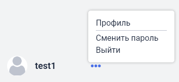
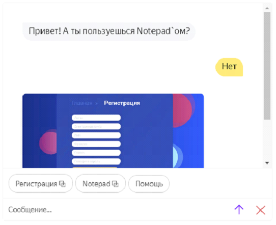
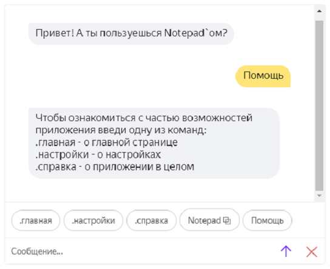

# Notepad

## Описание

>**Notepad - создавайте заметки, записывайте мысли, сохраняйте ссылки!**

**Notepad** позволяет создавать _папки_ и добавлять в них
_текстовые заметки_. 

## Запуск

>Запустить проект локально можно с помощью любой IDE или cmd.

    PyCharm и др. IDE: стандартный запуск
    cmd: python run.py

>Также проект размещен на Heroku:

    в целях анонимности ссылка была временно удалена :)

#### Как использовать?

>**Notepad** позволяет создавать папки и в них создавать текстовые заметки.
Но для этого нужно авторизоваться (внизу кнопка Войти, затем Зарегистрироваться, если у Вас еще нет аккаунта).
    
#### Авторизация
>Неавторизованному пользователю доступны только вкладки _Главная_ и _Справка_. На них можно ознакомиться с приложением.

>Вам придет письмо на указанную при регистрации электронную почту.
В нем будет содержаться логин и пароль от Вашего аккаунта. 
Также при изменении пароля или удалении аккаунта будет отправлено уведомляющее письмо. 

#### Главная
>На _Главной_ странице располагается список созданных папок (если вы только что зарегистрировались, то он пуст).
Кликнув по иконке папки, можно посмотреть заметки, находящиеся в этой папке.

>Чтобы создать папку, нужно перейти на вкладку _Управление_ и нажать на кнопку плюс.

>А чтобы создать заметку, нужно кликнуть по иконке папки, а затем по кнопке плюс.
Заметки можно редактировать (кнопка карандаша) и удалять (кнопка крестика).

#### Управление

>Тут происходит управление всеми папками,
> то есть добавление (кнопка плюс) и удаление (кнопка крестика).

#### Настройки

>Отображают количество созданных заметок, папок, и дату последнего изменения.

#### Справка

>Здесь находится основная информация о приложении и иллюстрации.

#### Профиль
>Чтобы перейти в профиль, нужно навести курсор на иконку с тремя точками
> (в самом низу около логина). Затем в появившемся меню перейти в профиль. Редактировать профиль можно по соответствующей кнопке.

>Выход и изменение пароля осуществляются через это же меню.

## Описание API

#### REST-API

- Получение списка всех пользователей `/api/users`
- Получение одного пользователя по id `/api/users/user_id`
- Редактирование и удаление пользователей

- Получение списка всех папок и одной папки по id `/api/folders`, `/api/folders/folder_id`
- Редактирование и удаление папок 
- Получение списка всех заметок и одной заметки по id `/api/notes`, `/api/notes/note_id`
- Редактирование и удаление заметок 

>API тестировалось с помощью библиотеки pytest.
> 
#### Навык Яндекс Алисы

>Бот в общих чертах рассказывает о приложении Notepad - отправляет иллюстрации приложения, описание функционала и возможностей.

Навык также размещен на Heroku:

    в целях анонимности ссылка была временно удалена :)

Код бота находится в отдельной папке и его также можно запустить локально.

    В папке /docs находятся файлы с более подробным описанием работы и скриншотами
